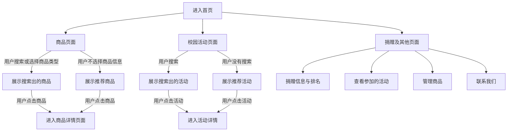

# 四位一体振乡村

​	总览：此小程序旨在开发一个综合性平台，汇集学校、个人、农户和市场的信息，搭建一个信息的集散港口方便社会各界与乡村交互，小程序本身不作为交易平台，而是收集和曝光提供交易渠道和信息。

## 目录

> ### 选题
>
> > 1. 产品解决的问题
> > 2. 产品方案
>
> ### 需求分析
>
> > 1. 用户分析
> > 2. 系统需求
> > 3. 竞品分析
>
> ### 产品模块
>
> > 1. 模块设计
> > 2. 校园模块
> > 3. 捐赠模块
> > 4. 商品模块
>
> ### 产品实现
>
> > 1. 小程序端
> > 2. 服务端
>
> ### 产品未来
>
> > 1. 当下痛点
> > 2. 未来方案
## 选题

### 解决的问题

​	当下各大电商平台为农户售卖商品提供了新途径，然而部分平台乱象如虚假宣传产地贫困、虚假配图如”xx滞销“等也随之产生。同时当下关于乡村农产品的比较散乱碎片，缺少一个平台来集散这些信息，因此我们希望通过这个小程序来实现对这些农产品信息的统一处理。

### 产品方案

​	我们将设计一个方便易用的平台，用户可以在平台上捐赠物品、参与学校活动或提供农产品信息。

## 需求分析

### 用户分析

​	用户有三类：社会人士、校园人士（包括学生和学校）、农户，实际上在小程序内三者没有严格的边界。校园人士的需求是通过平台可以便捷地管理校园对接农村的活动，农户希望可以通过平台更好地曝光自己的产品来实现乡村的振兴，而社会人士则希望通过平台捐赠闲置的物品到部分贫困的乡村地区。

### 系统需求

#### 功能需求

​	需要捐赠系统的上传功能，商品的上传、修改、删除、展示功能，校园活动的报名和搜索功能。

#### 非功能需求

1. 需要页面快速请求，不会因为与后端的交互而卡顿。
2. 不会重复请求，如果已经查询到所有数据则不会再次查询。
3. 用户信息安全：只需要利用微信授权登录来获得昵称和头像，其他用户无权获取他人信息。其他用户也只能在排行榜中看到他人的昵称和头像。

### 竞品分析

​	当下市场上的关于农产品的出售平台有很多，我们挑选橙心优选对比分析。

- 首先平台的功能不同，虽然橙心优选也主打农产品出售，但它本身作为提供出售的整个流程的平台出现，而不是像本产品作为信息集散平台出现。因此本产品可以通过一些推荐算法更好地提高贫困地区产品的曝光度从而实现更加精准的扶贫。
- 其次，这类平台基本上只瞄准了农产品的出售，而没有为校园和社会人士提供助农的机会。本平台通过提供校园助农活动的同意管理平台和便捷的个人捐赠的方式，覆盖人群更广，眼界不仅放在市场中，这也是本产品的创新之处。
- 而对于其他的助农平台，我们这款产品主要关注个体而非企业，一些希望为乡村振兴助力的用户可以通过本平台贡献自己的力量。

## 产品模块

### 模块设计

​	小程序围绕农产品、校园活动、个人捐赠3个模块展开，因此我们设计了产品、捐赠和校园三个模块，这三个模块分立与tabbar上，用户登录时首先进入首页，首页上会展示这三个各自的少部分信息，用户通过tabbar或者“更多”按钮来切换模块。

### 校园模块

​	校园模块主要提供校园活动的管理平台。校园活动需要学校联系管理员来上传活动到数据库，用户通过校园活动的主页进入校园活动列表，同时用户也可以进入某个活动的具体页面查看更多信息并进行报名操作，也可以查询自己报名的活动。

### 捐赠模块

​	此模块比较简单，和它有关的是捐赠表单和用户捐赠分数排名。用户填写捐赠表单来提交捐赠信息，系统会记录捐赠物品的数据，捐赠流程结束后会增加捐赠积分。

### 商品模块

​	此模块最为重要，用户通过此模块搜索查看农产品信息，农户通过此模块发布和管理自己的农产品信息。小程序本身不承担买卖责任，而是通过严格的审查机制筛选出真正贫困农户来曝光销售渠道以帮助他们进行农产品资源售卖。

## 产品实现

### 小程序端

- 小程序端使用colorUI开源组件库处理部分样式，使得页面更加美观可交互，同时也缩短了开发时长。
- 抽离商品列表、活动列表、搜索等作为小程序的组件防止重复开发。
- 提供util.js来进行提交图片、设置活动样式等操作。

### 服务端

- 本产品使用微信官方提供的云函数、云数据库和云存储技术。
- 用户的信息利用userInfo数据库存储。
- 用户在提交商品或捐赠物品信息时需要上传图片到云存储中，上传图片后会返回图片的云存储路径，我们将图片路径和其他基本信息存入对应的product或donateInfo数据库。
- 用户对自己的产品进行管理时，云函数端提供了删除和修改的方法操作product数据库中的对应条目。
- 用户查看活动或商品时通过对应的activities或product函数获取有限的（10个）数据，上拉到底时自动获取更多数据。
- 为了防止云函数过多导致混乱，我们只开发了product、userInfoOptions、activities、donateInfo、other云函数分别用来处理商品、用户信息、活动、捐赠以及其他用户操作，通过判断用户传入的参数来进行不同的函数行为。

## 产品未来

###  当下痛点

1. 当下由于人力资源有限，此产品尚未建立审核机制，缺少审核人员。
2. 没有建立起对应的管理端，管理员修改需要手动操作数据库。
3. 没有自己的成熟的数据加密方法。数据安全性有待提高。
4. 部分服务端操作会导致时间和空间的浪费。
5. 尚未找到合适的农产品曝光度算法。

### 解决方案

1. 如果项目落地将会招收审核人员处理农产品和捐赠物品的审核。
2. 未来上线管理端小程序。
3. 自己研发或者购买专业的安全算法。
4. 建立更优的数据库索引机制和数据库增删改查算法。